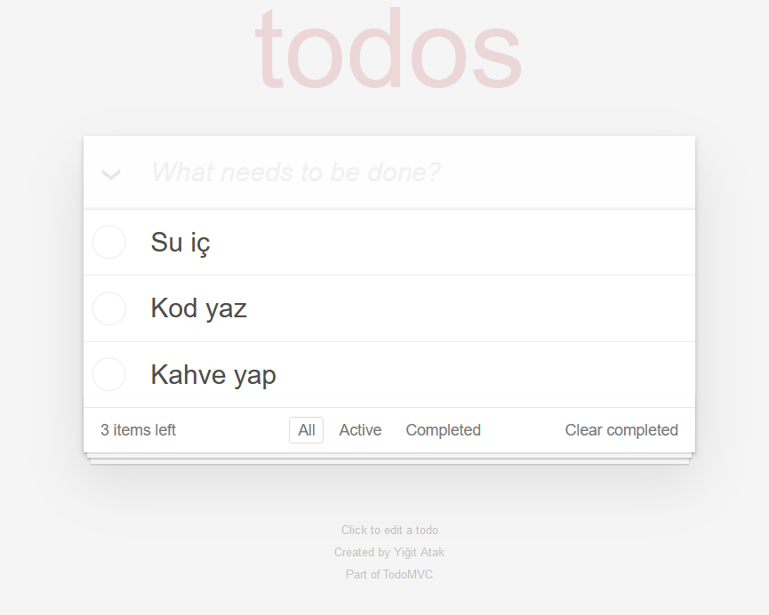

# Patika.dev - React ToDo App (Assignment 2)
This is part of a front-end course I'm currently taking on the [patika.dev](https://app.patika.dev/) platform.
It's a simple to-do app using vanilla React. All the comments are written in Turkish.

## Packages
[uid](https://www.npmjs.com/package/uid)

## Install
First, clone the repository into your local workspace:
```
    git clone https://github.com/Arintia/todo-react.git
```

Then, navigate into the project directory:
```
    cd todo-react
```

Then, install all the dependencies:
```
    npm i
```

Finally, run the project in development mode:
```
    npm run dev
```

## Screenshots
- ### List

- ### Complete

- ### Delete

- ### Filter


## License
[MIT](https://choosealicense.com/licenses/mit/)